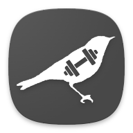

<p align="center">
  
</p>
<h1 align="center">FitISO</h1>
 
<p align="center">
  A local-first, single-user workout tracker built with .NET MAUI.
</p>
 
## About the name
 
**FitISO** = *Fit*ness + *ISO*lation. It's a local-only app, no accounts, no cloud sync, no server - just you and a SQLite file on your phone. Single user, isolated data, hence the name.
 
The logo is a bird holding a dumbbell because it's also a wordplay with [**Fitis**](https://birdwatchingalentejo.com/willow-warbler-fitis-felosa-musical-mosquitero-de-los-sauces/), the Iberian name for the Willow Warbler. That's it, that's the whole joke.
 
Congrats, you just read a whole paragraph about a bird. Anyway, here's what the app actually does:
 
## Features
 
- **Active workout tracking** - a persistent live timer, editable weight/reps per set with debounced autosave, and swipe gestures to quickly add or remove sets from an exercise.
- **Set completion progress** - a thin progress bar in the title bar fills up as you complete sets (weight + reps both entered) during the active workout, giving an always-visible sense of how far along you are without eating into scroll space.
- **Personal records & history at a glance** - each exercise card surfaces your best-ever set and your most recent sets for quick comparison while you train.
- **Exercise library** - browse, search, add, and inspect exercises via dedicated popups.
- **Workout templates** - save and reuse workout structures instead of building them from scratch every time.
- **Workout history** - review past completed workouts, with one-tap PDF export for sharing and a monthly calendar heatmap showing which days you trained. Step month-by-month, swipe left/right or jump straight to your first workout month or back to the present.
- **Rest stopwatch** - an optional rest stopwatch during active workouts that auto-starts the moment a set is marked complete (weight + reps both entered), survives app restarts/kills via persisted state and can optionally chain into the next exercise's first set instead of stopping when you finish the last set of an exercise. Toggle it from Settings.
- **Custom tab bar** - a shaped bottom navigation bar (via `Nalu.Maui`) with a context-sensitive action button (e.g. "add exercise" while a workout is active).
- **Accent themes** - switch the app's accent palette from Settings.
- **Backup & restore** - export the SQLite database to a `.db3` file from Settings, and import a backup back in later.
- **Auto backup** - optionally back up the database automatically to your phone's Downloads folder every time you finish a workout.
- **Home screen widgets (Android)** - favourite exercise best set, favourite exercise history chart, favourite workout quick-start, days since last workout, last workout summary and monthly workout heatmap.
- **App shortcuts (Android)** - long-press the app icon to quickly jump to your favourite workout or your workout history.

## Tech stack
 
| Project (layer) | Responsibility | Technologies |
|---|---|---|
| `FitISO.Data` | Persistence | Entity Framework Core 10, SQLite |
| `FitISO.Services` | Business logic | Plain C#, depends only on `FitISO.Data` |
| `FitISO.Maui` | Presentation | .NET MAUI (`net10.0` — Android, iOS, Mac Catalyst, Windows), CommunityToolkit.Mvvm (`ObservableObject`, `[RelayCommand]`, `[ObservableProperty]`, `WeakReferenceMessenger`), CommunityToolkit.Maui (toasts, `Expander`, etc.), [Nalu.Maui](https://nalu-development.github.io/nalu/index.html) (`Nalu.Maui.Navigation` & `Nalu.Maui.Layouts`) |
| `FitISO.Tests` | Testing | NUnit, `Microsoft.EntityFrameworkCore.InMemory` |
 
## Architecture

The solution is split into four projects, layered so the UI depends on services and services depend on data - never the reverse:

```
FitISO.Data/            EF Core DbContext, entity models and migrations.
FitISO.Services/        Business logic sitting between the UI and the database. Depends only on FitISO.Data.
FitISO.Maui/            The MAUI app itself:
  ├─ Models/             UI-facing observable wrappers around the FitISO.Data entities.
  ├─ ViewModels/         One view model per page/popup, using CommunityToolkit.Mvvm.
  ├─ Views/              XAML pages and popups.
  ├─ Rendering/          Imperative SkiaSharp canvas-drawing code, invoked from code-behind.
  ├─ Messages/           WeakReferenceMessenger message types for cross-view-model communication.
  ├─ Services/           MAUI-layer application services (settings, backup, widget state) — see note below.
  ├─ Converters/         Value converters for XAML bindings.
  ├─ Resources/          Styles, accent-theme resource dictionaries, fonts, images.
  └─ Platforms/          Per-platform entry points and platform-specific code.
FitISO.Tests/           NUnit tests for the service layer, backed by EF Core's in-memory provider.
```

Two pairs of names are easy to mix up across layers:

- **`FitISO.Maui.Models`** vs **`FitISO.Data.Models`** - the `Data` models are plain EF entities, while the `Maui` models are `ObservableObject` - based wrappers that add change notification, debounced autosave and null-coercion needed for live-editable UI, without polluting the persistence layer with UI concerns.
- **`FitISO.Services`** (the project) vs **`FitISO.Maui/Services`** (the folder) - the former is plain C# with zero MAUI/platform dependencies and is what's covered by `FitISO.Tests`; the latter is MAUI-side glue that talks to `Preferences`, the file system, or Android widget APIs (e.g. `WorkoutSettingsService`, `AutoBackupService`, `MonthlyHeatmapService`), and generally wraps or coordinates calls into the former rather than duplicating its logic.